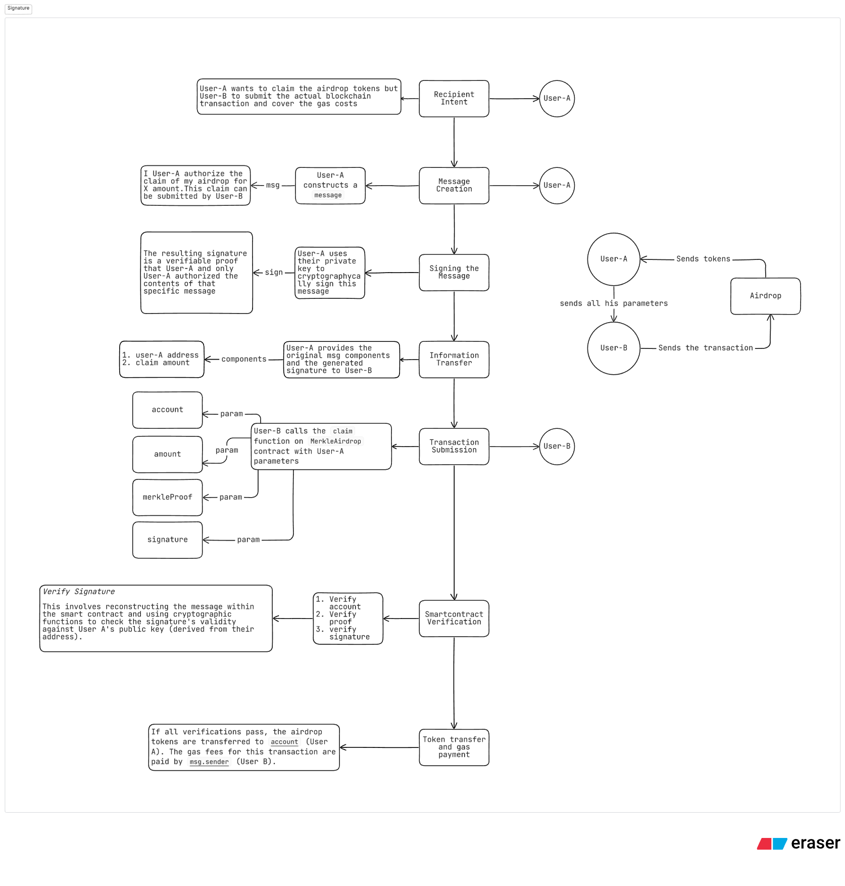
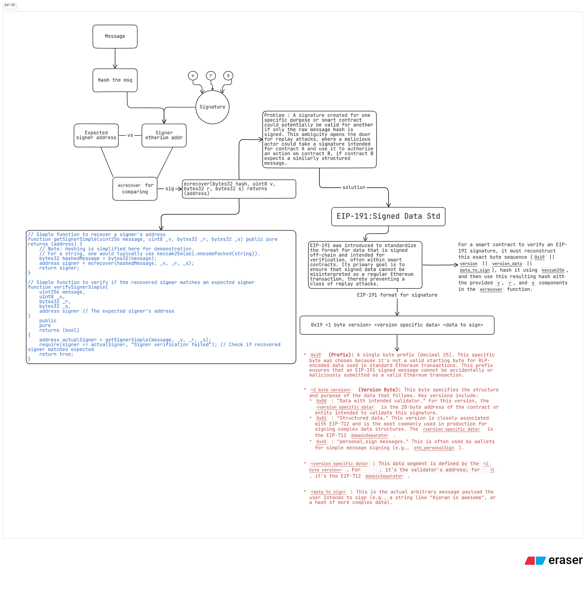
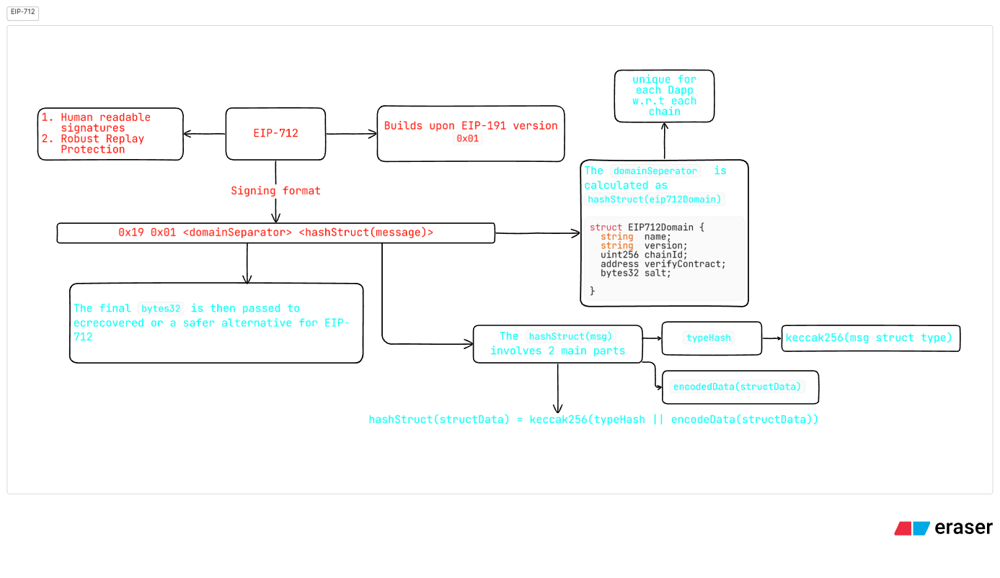
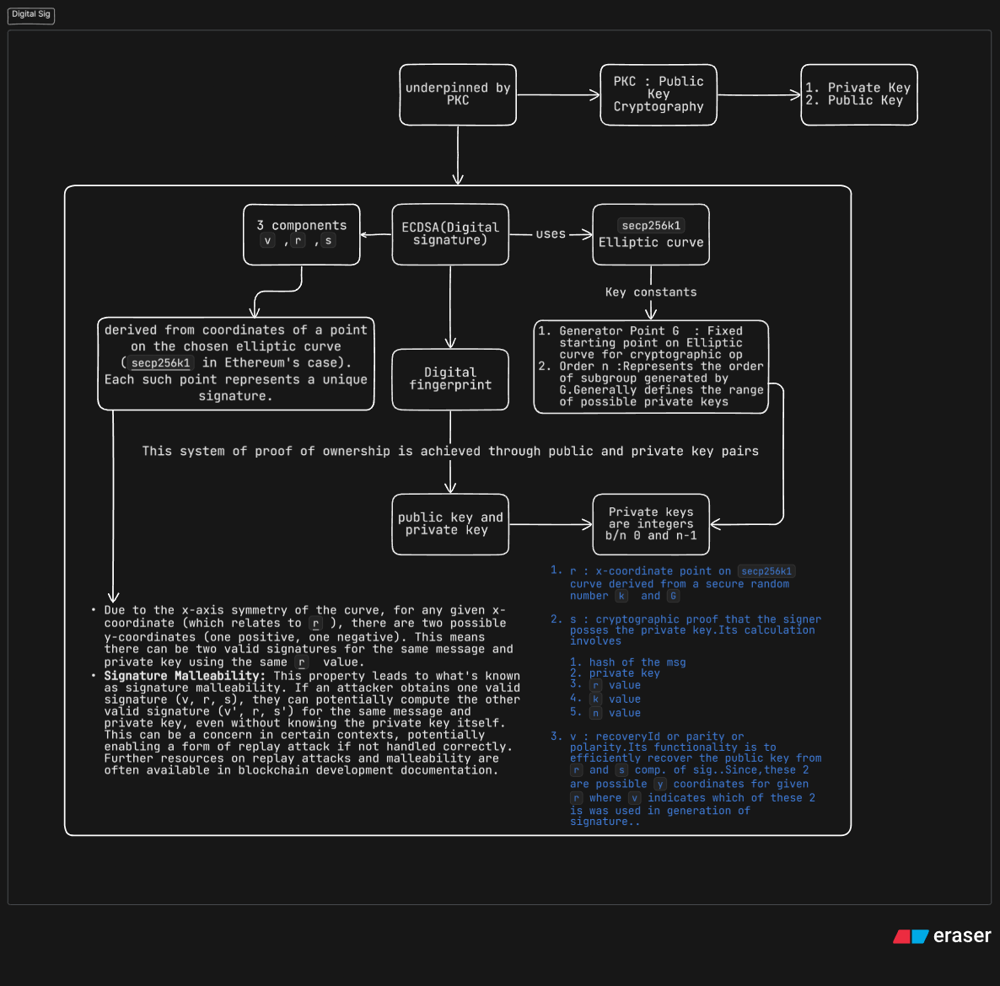
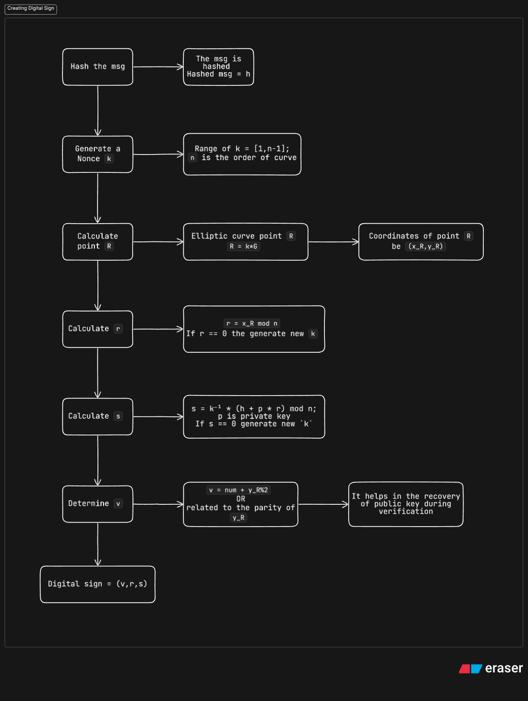
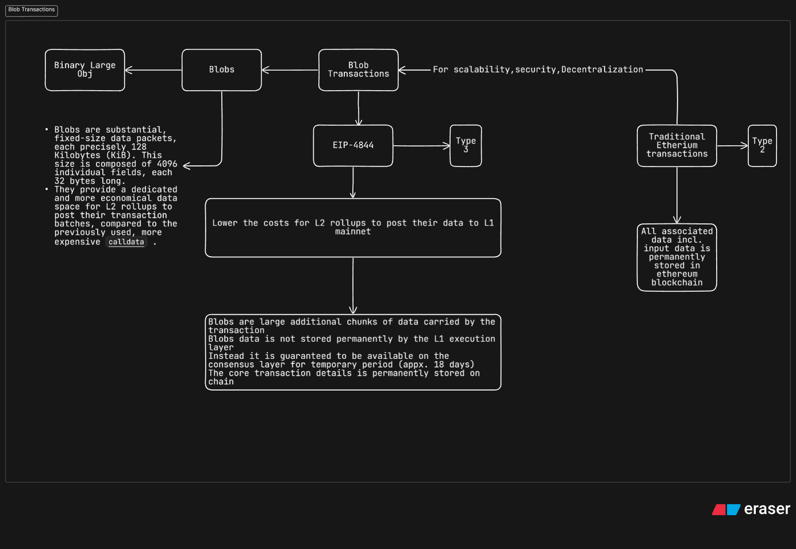
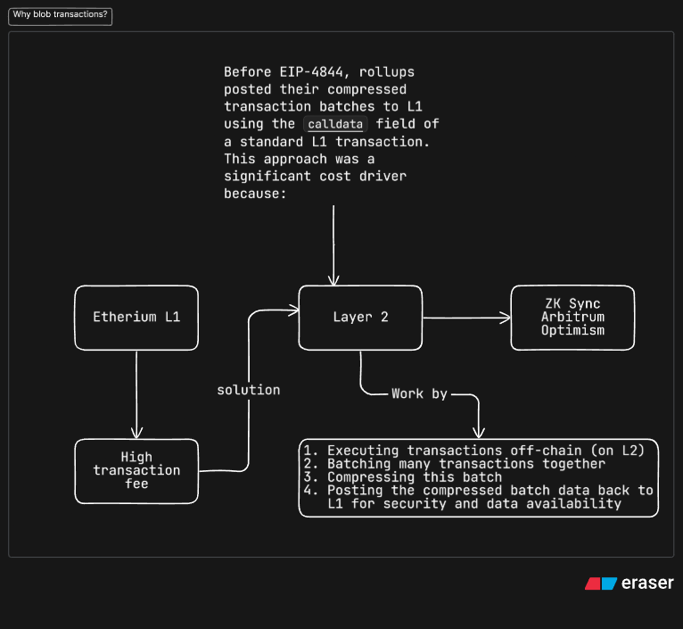
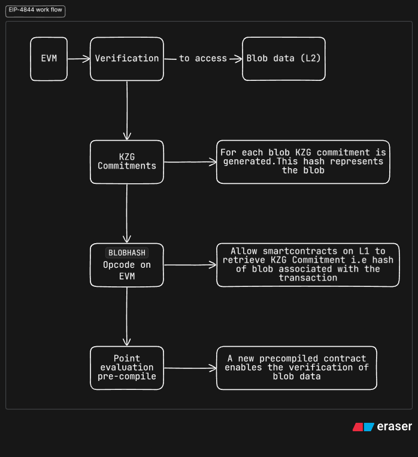

TODO : BUilding an advanced Merkle Airdrop with foundry and Digital signatures

GOAL : Build an efficient system for token distribution that allows for eligibility verification via merkle proofs and authorized and potentially gasless claims using cryptographic signatures

# Airdrop
Process where a token development team distribution team distributes their tokens to the community for free, usually to reward early adopters, increase token liquidity, or bootstrap network effects.

For this project we will be using ERC20 tokens for airdropping

# Project overview
`src/BagelToken.sol` : ERC20 token which will be distributed through airdrop

`src/MerkleAirdrop.sol` : Contract to handle the airdrop

This contract handles 
1. Merkle proof verification
2. `claim` function
3. Gasless claims
4. Signature verification : checks the V,R,S components of the ECDSA signature preventing the unauthorized claims

`script/GenerateInput.s.sol` : Used for preparing the data (list of eligible addresses and amounts) and generating the merkle tree

`script/MakeMerkle.s.sol` : Used for constructing merkle tree from the input data.Generates individual merkle proofs for each address and computing the merkle root hash
These root hash are stored in `src/MerkleAirdrop.sol`

`script/DeployMerkleAirdrop.s.sol` : A deployment script for the MerkleAirdrop.sol contract.

`script/Interact.s.sol` : Used for interacting with the deployed airdrop contract, primarily for making claims.

`script/SplitSignature.s.sol` : A helper script or contract, possibly for dissecting a packed signature into its V, R, and S components for use in the smart contract.

# Learning Obj
1. Merkle Trees and Merkle Proofs
2. Digital signatures
3. ECDSA
4. Transaction types

# Project flow
1. Deploy the `BagelToken.sol` contract
2. Deploy the `MerkleAirdrop.sol` contract
3. Sign Message
4. Fund contracts
5. Claim tokens
    Verification process for claiming
    1. Submit their claim details(incl. address and amount they are eligible for) to the smart contract 
    2. Submit their Merkle Proof : Merkle proof contains a small set of hashes from the merkle tree
    3. Smart contract then uses the users submitted data and the provided merkle proof to recalculate the merkle root hash
    4. If this recalculated root matches the Merkle root stored in the contract, it cryptographically proves that the user's data (address and amount) was part of the original dataset used to generate the tree. This verification occurs without iterating through any lists on-chain.
6. Verify balance

# Used libraries 
1. OpenZeppelin Contracts for standard functionalities like ERC20 tokens and Access control

```bash
forge install openzeppelin/openzeppelin-contracts
```

2. Adding to remappings

```foundry.toml
remappings = [
    "@openzeppelin/contracts/=lib/openzeppelin-contracts/contracts/"
]
```

# Structure of Merkle Tree
Merkle tree is a hierarchical data structure built from hashed data.

* Merkle Trees


The primary issue with the Naive approach is that it requires storing all the data on-chain, which can be expensive and inefficient. 

Merkle Trees can solve this problem by storing only the root hash of the tree on chain

When a user claims, they provide their address (the leaf data) and the corresponding Merkle proof. The contract then performs a fixed number of hashing operations to verify the proof. 

The number of operations is proportional to the depth of the tree (log N, where N is the number of leaves), which is significantly more scalable and gas-efficient than iterating through N elements.

# Key functionalities in `MerkleProof.sol` 
1. `verify`

```solidity
function verify(bytes32[] memory proof /** Merkle Proof*/,bytes32 root,bytes32 leaf) internal pure returns(bool){
    return processProof(proof,leaf) == root;
}
```
The merkle proof contains the array of sibling hashes

2. `processProof`

```solidity
function processProof(bytes32[] memory proof,bytes32 leaf) internal pure returns(bytes32 computedHash){
    bytes32 computedHash = leaf;
    for(uint i = 0;i<=proof.length;i++){
        computedHash = _hashPair(comptedHash,proof[i]);
    }
    return computedHash;
}
```

3. `_hashPair`

```solidity
function _hashPair(bytes32 a,bytes32 b) internal pure returns(bytes32){
    return a<b?keccak256(abi.encode(a,b)):keccak256(abi.encode(b,a));
}
```
> Openzeppelin's actual implementation i.e `_efficientHash` uses assembly for optimized `keccak256` hashing

For generating the Merkle Trees and proofs within our foundry project we will use `murky` library available at 
```
https://github.com/dmfxyz/murky
```
This library provides tools for constructing Merkle trees and generating proofs directly within Foundry scripts.

# DS for Merkle Tree Generation
We will use 2 `json` files to manage the Merkle tree data these files are stored in `script/target` folder

1. `input.json` : Contains the raw data genertad by `script/GenerateInput.s.sol`
2. `output.json` : Generated Merkle Tree information genertad by `script/MakeMerkle.s.sol`

Example of `input.json`

```json
{
  "types": [
    "address", // for account address
    "uint" // for amount
  ],
  "count": 4, // number of leaf nodes
  "values": { // leaf node data
    "0": { // leaf node -0
      "0": "0x6CA6d1e2D5347Bfab1d91e883F1915560e891290", // addr
      "1": "2500000000000000000" // amt
    },
    "1": { // leaf node -1
      "0": "0xAnotherAddress...", // addr
      "1": "1000000000000000000" // amt
    }
    // ... other values up to count-1
  }
}
```

Example of `output.json`

```json
{
  "inputs": [
    "0x6CA6d1e2D5347Bfab1d91e883F1915560e891290", // addr
    "2500000000000000000" // amt
  ],
  "proof": [ // hashes to make the Merkle root i.e sibling hashes
    "0xfd7c981d30bece61f7499702bf5903114a0e06b51ba2c53abdf7b62986c00aef", // sibling hash
    "0x46f4c7c1c21e8a0c03949be8a51d2d02d1ec75b55d97a9993c3dbaf3a5a1e2f4" // sibling hash
  ],
  "root": "0x474d994c59e37b12805fd7bcbbcd046cf1907b90de3b7fb083cf3636c0ebfb1a", // merkle root hash
  "leaf": "0xd1445c931158119d00449ffcac3c947d828c359c34a6646b995962b35b5c6adc" // leaf node hash
}
// This structure is repeated for each leaf in the airdrop.
```

Installing the `murky` library

```bash
forge install dmfxyz/murky
```

Output json file generation flow:
1. GenerateInput.s.sol Execution: This script creates script/target/input.json, which lists all airdrop recipients (addresses) and their corresponding token amounts.

2. MakeMerkle.s.sol Reads Input: This script ingests the input.json file.

3. Leaf Hash Calculation: For each address/amount pair from input.json:

4. The address and amount are ABI-encoded (after necessary type conversions to bytes32).

5. The ABI-encoded data is trimmed (e.g., using ltrim64) to remove encoding overhead.

6. This trimmed data is then double-hashed (keccak256(bytes.concat(keccak256(trimmed_data)))) to produce the final bytes32 leaf hash.

7. Merkle Tree Construction with murky: MakeMerkle.s.sol uses the murky library, providing it with all the generated leaf hashes. murky then:

8. Calculates the single Merkle root for the entire dataset.

9. Generates the unique Merkle proof for each individual leaf.

10. output.json Generation: All the generated data—original inputs, the proof for each leaf, the common Merkle root, and each leaf's hash—is written to script/target/output.json.

To integrate the deployed contracts with the tests install `foundry-devops`

```bash
forge install cyfrin/foundry-devops
```

# Optimizing Merkle Airdrop claims : Authorization and Gas Fee Management
Challanges in the current `MerkleAirdrop` `claim` function

```solidity
function claim(address account,uint256 amount,bytes[]32 calldata mekleProof) external{
  if(sHasClaimed[account]) revert MerkleAirdrop__AlreadyClaimed();
  bytes32 leaf = keccak256(bytes.concat(keccak256(abi.encode(account,amount))));
  if(!MerkleProof.verify(mekleProof,sRoot,leaf)) revert MerkleAirdrop__InvalidProof();
  sHasClaimed[account] = true;
  emit Claim(account,amount);
  token.safeTransfer(account,amount);
} 
```

The primary issue : Premission less regarding who can initiate a claim while this airdrop works and claiments receive tokens but there is no direct contact between the user and the airdrop contract.Instead there is a third person who initiated this airdrop.

"This raises concerns: a user might receive an airdrop—and any associated tax liabilities or simply unwanted tokens—without having explicitly agreed to that particular claim event at that moment."

# Simpler Approach : Recipient-Initiated Claims and its limitations
It grants 2 things

1. Direct Consent: Only the rightful owner of the address (the one controlling the private key for msg.sender) can initiate the claim for their tokens.

2. Recipient Pays Gas: The account calling claim (i.e., msg.sender) would inherently be responsible for paying the transaction's gas fees.

While this modification effectively addresses the consent problem, it introduces a new limitation. It removes the flexibility of allowing a third party to cover the gas fees for the claim. This can be a desirable feature in scenarios where a project wishes to sponsor gas costs for its users, or when a user prefers to delegate the transaction submission to a specialized service to manage gas

# Advanced Solution : Enabling gasless claims with digital signatures

This method allows an account to explicitly consent to receiving their airdrop while still permitting another party to submit the transaction and pay the associated gas fees.

## Process flow


# Etherium Signatures : EIP-191 and EIP-712

Basic Signature verification
# EIP-191


Example Implementation of `EIP-191` version-`0x00`

```solidity
function getSigner(uint256 message,uint8 _v,bytes32 _r,bytes32 _s) public view returns(address){
  bytes1 prefix = bytes1(0x19);
  bytes1 eip191Version = bytes1(0x00);
  address intendedValidatorAddr = address(this);
  bytes32 applicationSpecificData = bytes32(message);
  // EIP-191 formatted msg
  bytes32 hashedMsg = keccak256(abi.encode(prefix,eip191Version,intendedValidatorAddr,applicationSpecificData));
  // recover the signer
  address signer = ecrecover(hashedMsg,_v,_r,_s);
  return signer;
}
```

While `EIP-191` standardizes the signing format and adds a layer of domain separation (e.g., with the validator address in version 0x00), version `0x00` itself doesn't inherently solve the problem of displaying complex `<data to sign>` in a human-readable way in wallets. This is where `EIP-712` comes into play.

# EIP-712 : Typed Structured Data hashing and signing


Example Implementatio of EIP-712

1. Define your message

```solidity
struct Message{
  uint256 number;
}
```

2. Calculate the `typeHash`

```solidity
bytes32 public constant MESSAGE_TYPE_HASH = keccak256(bytes("Message(uint256 number)"));
```

3. Calculate the `hashStruct(msg)`

```solidity
/// Assuming `messageValue` is the uint256 value for the `number` 
Message myMsg = Message({number : messageValue});
bytes32 hashedMessagePayload = keccak256(abi.encode(MESSAGE_TYPE_HASH,myMsg));
/// More generally, for a struct 'Mail { string from; string to; string contents; }'
bytes32 MAIL_TYPEHASH = keccak256(bytes("Mail(string from,string to,string contents)"));
bytes32 hashStructMail = keccak256(abi.encode(MAIL_TYPEHASH, mail.from, mail.to, mail.contents));
```

That will be `keccak256(abi.encode(MESSAGE_TYPEHASH,actual_value_of_number_field))`

4. Calculating the `domainSeperator` : typically done once often in the contract constructor
It involves hashing an instance of `EIP712Domain` struct

```solidity
// Pseudo-code for domain separator calculation
EIP712DOMAIN_TYPEHASH = keccak256(bytes("EIP712Domain(string name,string version,uint256 chainId,address verifyingContract,bytes32 salt)"));
domainSeparator = keccak256(abi.encode(
    EIP712DOMAIN_TYPEHASH,
    "MyDAppName",
    "1",
    block.chainid, // or a specific chainId
    address(this),
    MY_SALT // some bytes32 salt
));
```

5. Calculating the final digest
```solidity
bytes32 digest = keccak256(abi.encodePacked(
    bytes1(0x19),
    bytes1(0x01),
    domainSeparator,
    hashedMessagePayload 
));
```

6. Recover the signer

```solidity
address signer = ecrecover(digest, _v, _r, _s);
```

In this project we are going to use Openzeppelin lib(`EIP712.sol`,`ECDSA.sol`) for implementing EIP-712

[Example Implementation](https://gist.github.com/gnvvs-2003/77d8d453e8edcbd36b70190037f72f09)

# Digital Signatures and v,r,s values 
ECDSA : Elliptic Curve Digital Signature Algorithm and its characteristics v,r,s are fundamental components in the world of blockchain and web3 security

ECDSA functionalities
1. Generating Key pairs
2. Creating Digital signatures
3. Verifying Digital signatures

Think of an ECDSA signature as a digital fingerprint – unique to each user and their specific message.

This system of proof of ownership is achieved through public and private key pairs, which are the tools used to create these digital signatures. The entire process is underpinned by Public Key Cryptography (PKC), which uses asymmetric encryption (different keys for encrypting/signing and decrypting/verifying).



# Generating Digital Identity:ECDSA Key pairs
Generating ECDSA key pair includes 2 steps
1. Private key(p or sk):A private key is generated by choosing a cryptographically secure random integer. This integer must fall within the range of 0 to n-1, where n is the order of the secp256k1 curve.

2. Public Key (pubKey or P): The public key is an elliptic curve point. It is calculated by performing elliptic curve point multiplication (also known as scalar multiplication) of the private key p with the generator point G. This is represented by the formula:
`pubKey = p * G`
The * here denotes a special type of multiplication defined for elliptic curves, not standard integer multiplication.

# Creating the Digital Signature:ECDSA Signing process
1. Hash the msg


# Validating Authenticity:ECDSA Verification process
The ECDSA verification algorithm confirms whether a signature is authentic and was generated by the holder of a specific private key, corresponding to a given public key. The process takes the following inputs:

1. The (hashed) signed message (h).

2. The signature components (v, r, s).

3. The public key (pubKey) of the alleged signer.

The algorithm outputs a boolean value: true if the signature is valid for the given message and public key, and false otherwise.

The verification process, in simplified terms, involves a series of mathematical operations that essentially try to reconstruct a value related to the signature's r component using the public key, the message hash, and the s component. If the reconstructed value matches the original r from the signature, the signature is considered valid.

## Verification steps
1. Calculate `S1 = s⁻¹ (mod n)`.

2. Calculate an elliptic curve point `R' = (h * S1) * G + (r * S1) * pubKey`. This involves elliptic curve scalar multiplication and point addition.

3. Let the coordinates of R' be `(x', y')`.

4. Calculate `r' = x' mod n`.

5. The signature is valid if `r' == r`.

> Ethereum's `ecrecover` Precompile:
Ethereum provides a built-in function (a precompile, meaning it's implemented at a lower level for efficiency) called `ecrecover`. The function `ecrecover(hashedMessage, v, r, s)` performs signature verification.

Instead of just returning true/false, if the signature `(v, r, s)` is valid for the `hashedMessage`, `ecrecover` returns the Ethereum address of the signer.

This is extremely useful for smart contracts, as it allows them to verify signatures on-chain and reliably retrieve the address of the account that signed a particular piece of data.

# Transaction types
1. Type-0 : `0x0` : Legacy transactions
2. Type-1 : `0x1` : EIP-2930 transactions : type-0+ access list
3. Type-2 : `0x2` : EIP-1559 transactions : type-1+ maxFeePerGas, maxPriorityFeePerGas

The key change introduced by EIP-1559 was the replacement of the simple gasPrice (used in Type 0 and Type 1 transactions) with two new components:

A baseFee: This fee is algorithmically determined per block based on network demand and is burned, reducing ETH supply.

A maxPriorityFeePerGas: This is an optional tip paid directly to the validator (formerly miner) to incentivize transaction inclusion.

Consequently, Type 2 transactions include new parameters:

maxPriorityFeePerGas: The maximum tip the sender is willing to pay per unit of gas.

maxFeePerGas: The absolute maximum total fee (baseFee + priorityFee) the sender is willing to pay per unit of gas.

4. Type-3 : `0x3` : EIP-4844 transactions : type-2+ blob

Key features of Type 3 transactions include:

A separate fee market specifically for blob data, distinct from regular transaction gas fees.

Additional fields on top of those found in Type 2 transactions:

  1. max_fee_per_blob_gas: The maximum fee the sender is willing to pay per unit of gas for the blob data.

  2. blob_versioned_hashes: A list of versioned hashes corresponding to the data blobs carried by the transaction.

# ZkSync Specific Transaction types
1. Type 113 : EIP-712 or 0x71
2. Type 255 : Priority transactions or 0xff : Sending transactions from L1(Etherium) to L2(ZkSync) networks

# Blob Transactions


# Why Blob Transactions are needed : The Pre-Blob era


# Working of EIP4844 : Working of Blobs


## Blobs in Action
1. Rollup prepares data
The L2 rollup processes transactions, groups them together, and compresses them.
2. Send to L1 with blobs
It sends a special transaction (Type 3) to L1 that includes:
Normal transaction details
A commitment (hash) for each blob
Proofs to verify those blobs
A reference to the actual blob data (stored separately)
3. L1 checks the data
The smart contract on L1 reads the expected blob commitment
It uses a verification function (`precompile`) to check the proof
If valid → the data is confirmed correct and available
4. Temporary storage
The actual blob data is only stored for a short time
After that, it’s deleted
But the proof and record that it was valid stay forever on L1

# Sending a blob transaction
1. Setup
Connect to an Ethereum node (RPC)
Load your wallet (private key)
Import libraries like Web3.py
2. Prepare your data
Take your data (e.g. <( o.o )>)
Encode it into bytes (ABI encoding)

Important rule:

A blob must be exactly 128 KB
If your data is smaller → pad it with zeros (\x00)

👉 Think of it like filling a fixed-size box:

Too small → add empty space
Too big → not allowed
3. Create the transaction

  1. Normal fields (to, value, gas, etc.)
  2. Special blob fields:
  3. type: 3 → marks it as a blob transaction
  4. maxFeePerBlobGas → what you’re willing to pay for blob storage
4. Sign (this is where magic happens)

When signing, you pass your blob data:

  1. sign_transaction(tx, blobs=[your_blob])
  2. The library automatically:
  3. Creates commitments (KZG)
  4. Generates proofs

5. Send it
Broadcast the signed transaction
Wait for confirmation

# Final Overview of Singatures

Digital signature : A digital signature cryptographically proves that a msg is approved by the owner of the specific private key

Signature components 

1. r and s : op of signing algo
2. v : recovery identifier used to recover the public key of the signer from the signature and the msg hash

# Generating the message hash which has to be signed

After deploying 

```bash
== Return ==
0: contract MerkleAirdrop 0x5FC8d32690cc91D4c39d9d3abcBD16989F875707
1: contract BagelToken 0xDc64a140Aa3E981100a9becA4E685f962f0cF6C9

```

To obtain this message hash, you can use Foundry's cast call command to invoke getMessageHash on your deployed MerkleAirdrop contract. The command requires:

1. The MerkleAirdrop contract address (0x5FC8d32690cc91D4c39d9d3abcBD16989F875707).

2. The function signature: "getMessageHash(address,uint256)".

3. The arguments for the function: the claimant's address (0x6CA6d1e2D5347Bfab1d91e883F1915560e09129D) and the claimable amount (in wei) (25000000000000000000).

4. The RPC URL of your Anvil node.

```bash
cast call 0x5FC8d32690cc91D4c39d9d3abcBD16989F875707 "getMessageHash(address,uint256)" 0x6CA6d1e2D5347Bfab1d91e883F1915560e09129D 25000000000000000000 --rpc-url $ANVIL_RPC_URL
```

```bash
0xb387690e96f321204d7d743aec7cf68587afba07f9f086c043f9a3224a739a83
```

# Signing the hashed message
This signature serves as cryptographic proof that the owner of the private key authorizes the action associated with the message hash (in this case, claiming tokens). Foundry's cast wallet sign command facilitates this.

```bash
cast wallet sign --no-hash <message_hash> --private-key $ANVIL_PRIVATE_KEY 
```

```bash
0xbc4b0a35309255b611eb1544724cbf2eb0914bc323599e7e0602dc2dbf7d33ad5c28be5aa4c31fd8f56ec317bb848d1a5060fdafdd90844d5d7c3ac958a618431b
```

This command will output the digital signature as a hexadecimal string

# Deconstucting the Signature : v,r,s
r : first 32 bytes of signature
s : next 32 bytes of signature
v : final 1 byte of signature (recovery identifier)

# Validating the airdrop
```bash
ubuntu@L2003:~/airdrop-and-signatures$ cast call 0x5FC8d32690cc91D4c39d9d3abcBD16989F875707 "getAirdropToken()(address)" --rpc-url http://localhost:8545
0xDc64a140Aa3E981100a9becA4E685f962f0cF6C9
ubuntu@L2003:~/airdrop-and-signatures$ cast call 0xDc64a140Aa3E981100a9becA4E685f962f0cF6C9 "balanceOf(address)(uint256)" 0xf39Fd6e51aad88F6F4ce6aB8827279cffFb92266 --rpc-url h
ttp://localhost:8545
25000000000000000000 [2.5e19]
```